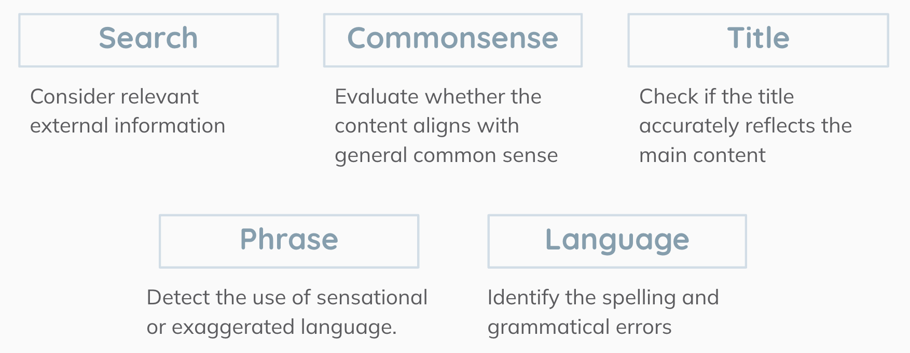

# Fake_News_Detection

## Project structure
### Data generation

### LLM agent module

### Search tool pipline


## How to run code
### Dataset
### Model
Change directory to `model/`, run:
```
python agent.py
```
Then the agent results would be saved under `log/`. You can change the testing news data in code by changing the path of dataset.

Run:
```
python baseline_truc.py
```
can train a BERT model on our dataset, saved as `bert_model_our.pt`

Run:
```
python baseline_pkl.py
```
can train a BERT model on weibo21 dataset, saved as `bert_model_weibo.pt`

